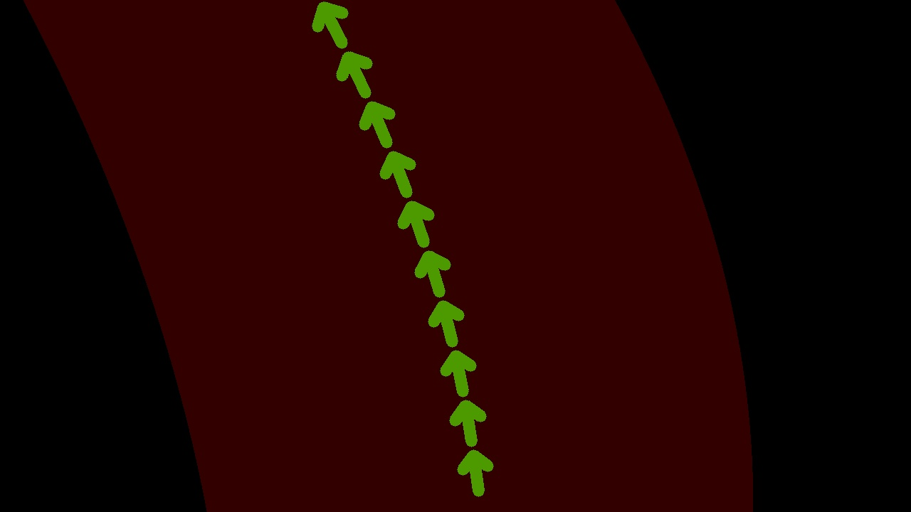
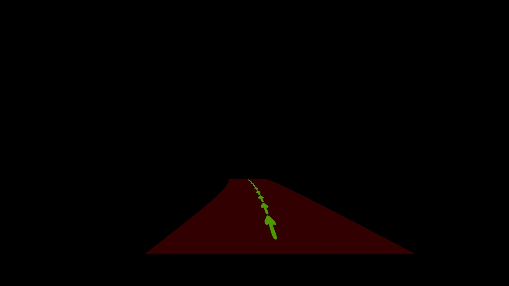
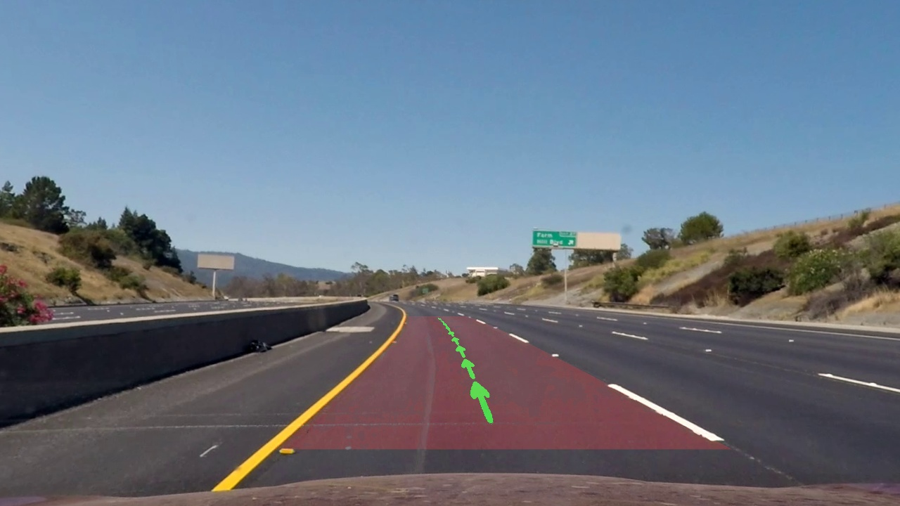
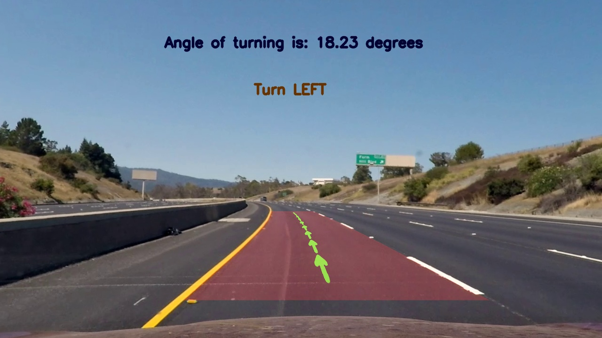

# Traffic Lane Detection and Turn Prediction
## Introduction
Two video sequences have been provided,(taken from a self driving car) to be tested on the algorithm being designed 
for the Lane Detection and Turn Prediction. 
The video is split into several image frames which are processed independently from each other. 
The lanes on the road are assumed to be parallel to each other and almost always ’vertical’, if looked at the image
straight from the top. The actual camera does not look at the road ’from the top’, but it always looks at the
road at the same angle. Hence we have computed the Homograpy and taken the perspective view for lane identification so that 
the lanes look parallel to each other and we get the top view.

Following are the overall steps followed in the project:
 * From one of the image frames, four points are selected during which the car moves straight. 
 These points are used to compute the **homography**.
 * The homography transformation calculated above works for most images, since the
tilt of the camera is constant. 
* Next the **input is prepared** for the lane detection task by using basic image processing techniques such as Edge Detection, noise removal and extraction of ROI.
* Once the image is processed and ready to be used for the actual task, we take the **perspective transform**, on which we build the **Histogram** of the Lane Pixels for both the lanes, using the homograpy computed earlier.
* The next step is to further refine the lane detection, by **fitting a polynomial** in between the lane candidates, and a curve of arrowed lines depicting the center of the lane.
* Using the lane coordinates we also **predict the turn** that the road takes along with the angle, so that the autonomous vehicle can make a turn in the required direction.
* The final step is to  project this back into the original image frame.

Following is a sample image frame on which the above functions are being performed.

## Prepare the Input
This step involves the following basic steps:
* The image is **undistorted** using the camera parameters which have been provided. 
Undistortion of an image can be done in 2 ways in OpenCV. In this project we have used the `cv2.undistort()` method, 
in which the inputs are the Camera matrix, the distortion matrix and the image frame. 
This function returns the undistorted image.  
* The image is denoised, Edge extraction can be applied but we did not find the need for it in the project.
* The top half of the edge detected image is then cropped, as only the bottom half of the image is required to detect the lanes, as the top half is only sky. 
 In other words, we extract the **Region of Interest** (ROI)

The left and the right lanes are detected in various steps as explained below:
### Detection of Yellow Lane}
* The image is first converted from the BGR colorspace to the **{HLS}(hue, saturation, lightness)** color image. 
Here the R, G and B are converted to floating-point format and scaled to fit the 0 to 1 range.
      

 
 As seen in the figure, the angular dimension starts at the red primary at 0°, passes through the green primary at 120° and the blue primary at 240°, and then wraps back to red at 360°. The central vertical axis comprises the neutral, achromatic, or gray colors, ranging from black at lightness 0 or value 0, the bottom, to white at lightness 1 or value 1, the top.
* Once the HLS colorspaced image is obtained, we have created a mask which uses the `cv2.inRange` function to get a mask between any 2 color bounds of images. 
* The **lower and upper bound** that has been used to get the mask for the yellow lane is: upper: BGR:[20,100,100] and lower: BGR:[25,255,255]
* **Perspective transform** is then applied on this yellow masked image. This is done using the image frame as the destination image. Any 4 coordinates of the road is considered to get the approximate dimensions of the the source image. This source and destination images are used for the calculation of the Homography. cv2.warpPerspective` is then performed. 
* Sharpening of the image is done on the warped image obtained above. This is done using the following two steps: **gaussian smoothing filter** and this smoothed version of the image is subtracted from the original image.
  - `cv2.GaussianBlur()`: This is a filter used to smmoothen the image. The kernel size used in this project is 5. This is like the coefficients of the filter. It helps to visualize a filter as a window of coefficients sliding across the image. Gaussian filtering is done by convolving each point in the input array with a Gaussian kernel and then summing them all to produce the output array.
  - `cv2.addWeighted()`: The subtraction of the smoothed image is done in a weighted way so that the values of the constant area remain constant. The weights used here are 1.5 and -0.5.
    
### Detection of White Lane
Similarly, the approach followed to get the White Lane is as follows:
* Here **perspective transform** is first performed on the image so that there is no overlap due to other white objects in the video. 
* The transformed image is then converted into a **gray scale** image for easy detection of the white lines. 
* Once the grayscaled image is obtained, a Gaussian blur is applied with a kernel size of 5. This is done using the `cv2.GaussianBlur` function as already explained for the yellow lines.
* A mask is then created using the `cv2.inRange` function, where the upper and lower bounds are 180 and 255 as it is a gray scaled image. 

## Histogram of Lane Pixels
* Once the yellow and white lanes are obtained in their respective ways, the 2 images are added to get the final image with both the lanes successfully detected. This is a gray scaled image. 
* This Y+W image is then converted to a **binary image**. The threshold used for the conversion is 100. All the pixel values less than 100 is assigned 1, and image pixels above 100 are assigned 0.
* **Histogram**: This binary image is then used to get the histogram. Histogram is basically a graph or plot, which gives an overall idea about the intensity distribution of an image. It is a plot with pixel values (ranging from 0 to 255) in X-axis and corresponding number of pixels in the image on Y-axis. 
  - `cv2.calcHist()` has been used to calculate the Histogram. 2 sliding windows have been used to traverse through the entire image both in the x and the y axis direction.
  - Each window is then considered as the image which is passed as the image parameter in the calcHist() function. As the image is now in grayscale, the channels is given as [0]. The perspective transform has already been taken, so we need the histogram of the entire image. Hence the mask is taken as "None". histSize or the BIN count has been taken as [3]. 
  - The output of the hist function is an array , whose each value corresponds to the number of pixels in the image with its corresponding pixel values.
  - This hist array is used to manipulate the right and the left lane coordinates as explained later.

Once we get the histogram array, we use the array to locate the right and the left lanes. These lanes are reshaped into a 2D array for both the lanes, to be used in the next step. 

## Polynomial Fitting
Once the right and left are fetched, using the intensity array graph provided by the histogram, we draw 2 lines to represent the right and the left lane. This is done using the function \textbf{numpy.polyfit()}. This returns a 2 degree polynomial using the least square method. Here, it returns the coefficients of y^{2}, y and the constant.

Now we fit a polygon between the 2 lanes to indicate the road being traversed between the lanes. This is done using the following approach:
* The y axis is taken using **linspace**
* Corresponding x coordinates are obtained using the coefficients obtained above using polyfit.This is done for both the right and the left lane.
* Now for the portion of the space between the 2 lanes, we consider a black image and and change it's color to the desired lane color if it's coordinates lie in between the lanes. This gives us the polygon as has been shown in the code.

## Fitting of arrowed lines

The next step is to fit arrowed lines in the middle of the polygon, for ease of visualization of the polygon.
Following is it's implementation:
* The coordinates of the center line is fetched almost in the same way as the right and left lanes using y as the linspace. The coefficients obtained for the lanes is averaged, and these form the coefficients for the center line.
* The index values to draw the arrows using the y axis and the center line. 10 such arrows are drawn as shown in the code using `cv2.arrowedLine()`

Thus all required lane manipulations has been done on the perspective transformed images. Now inverse perspection can be applied to project it back on the actual images. This is done in a similar way to the forward projection but with different source and destination images.

Polynomial fitting on the lane

Backprojection onto the original image

Weighted "and" with the original image

We have the lane polynomials, this makes it a basic geometry problem to predict the turning of the lanes. Using the definition of $tan\theta$, we also get the  approximate angle by which the lane turns. This has also been printed on the image frames for convenience and proof of implementation.

### Final Output with turn predicted

